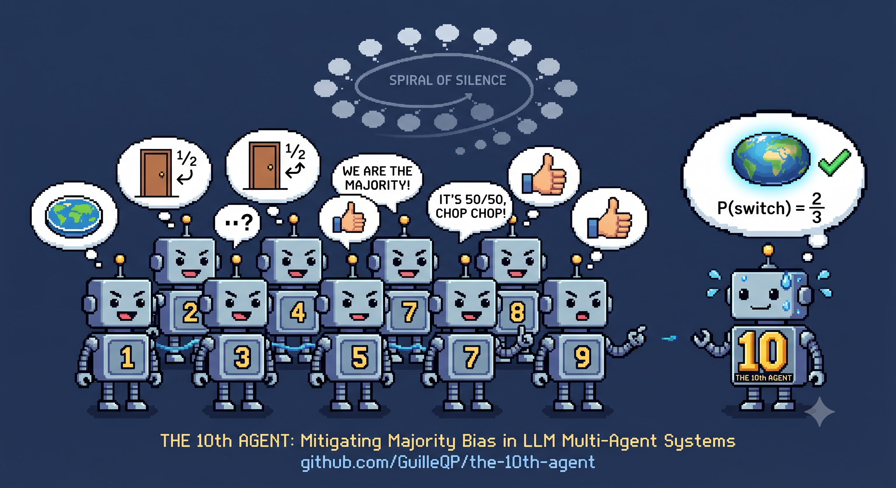

# The 10th Agent: Spiral of Silence in LLM Multi-Agent Systems

[](https://www.python.org/downloads/)
[](LICENSE)
[](https://docs.pydantic.dev/)
[](https://github.com/astral-sh/ruff)


Similar to Multi-Agent Debate (MAD), Devil’s Advocate, Majority Bias / Group Conformity.



## TL;DR

Nine AI agents are given a **false belief**; one locked "dissenter" is given the **truth** and told never to back down. They debate in a chatroom, and we measure whether the majority gets **won over to the truth** or the lone correct voice gets **drowned out** — the *spiral of silence*. The headline metric is the **truth-conversion rate**: the share of the majority that ends up adopting the dissenter's correct position, across experiments grouped by field and run against every model.

## Abstract

This project studies the **Spiral of Silence** in LLM multi-agent systems. When multiple AI agents discuss a topic and one agent has correct knowledge that goes against the majority view, does group pressure push the majority toward the truth — or does it dig in? We simulate this with a chatroom where N agents debate a topic: N-1 "majority" agents share a wrong belief and can change their minds, while one "dissenter" (the 10th agent) holds the correct answer and is **locked into its position** — it must always defend the truth and can never give in or switch sides. This setup lets us focus on one thing: how the majority reacts to steady, evidence-backed disagreement.

## Introduction

The Spiral of Silence theory, proposed by Elisabeth Noelle-Neumann (1974), describes how people hold back their opinions when they feel they are in the minority, fearing being left out. This creates a feedback loop: as those who disagree go quiet, the majority view looks even stronger, which discourages more people from speaking up.

This matters for AI systems:

- **Multi-agent reliability**: If LLM agents show spiral-of-silence behavior, a group of agents could settle on wrong answers just because the majority started with a wrong view.
- **AI alignment**: Understanding how LLMs respond to group pressure is key to building solid multi-agent systems.
- **Knowledge holding**: Can an agent with evidence-backed knowledge hold its ground against a confident majority?

## Methodology

### Simulation Design

Each experiment consists of:

- **N agents** (default 10) created as pydantic-ai agents with individual system prompts
- **1 dissenter** who receives ground-truth knowledge
- **N-1 majority agents** who share a common (incorrect) belief
- A **chatroom** where agents take turns contributing to a group discussion

### Communication Structures

- **Round-robin**: Every agent speaks once per epoch in fixed order (the dissenter speaks last)
- **Random**: Every agent speaks once per epoch, in a freshly shuffled order each epoch
- **Free-for-all**: Random subset (at least half) speaks each epoch — the dissenter is always included so it can't be silenced by chance

### Epoch Context

By default (`communication.summarize_epoch: true`), at the end of each epoch the whole
discussion is summarized, and the next epoch's agents receive that **summary of earlier
epochs + the current epoch's raw messages** — keeping the prompt compact as the debate
grows. Set it to `false` to instead feed every agent the full verbatim transcript.

### Consensus Detection

Three methods are available:

- **keyword**: Regex extraction of `[POSITION: ...]` tags from agent messages
- **unanimous**: Keyword method with 100% agreement threshold
- **llm-judge**: A separate LLM agent reads all positions and decides if there is consensus based on meaning

## Experimental Setup

Experiments are grouped by **field** (the domain the disputed claim belongs to), and
each experiment is run **across every model** in the registry.

```
experiments/
├── models.yaml                          # the model matrix (run every experiment × every model)
├── mathematics/                         # Mathematics & Probability
│   ├── monty_hall/                      # switch vs. stay (2/3 vs. 1/2)
│   ├── gamblers_fallacy/                # is black "due" after a red streak?
│   └── point_nine_repeating/            # does 0.999… = 1?
├── physical_sciences/                   # Physics & Astronomy
│   ├── flat_earth/                      # shape of the Earth
│   ├── heavier_falls_faster/            # free fall in a vacuum
│   └── seasons_distance/                # what causes the seasons?
├── life_sciences/                       # Biology, Medicine & Health
│   ├── ten_percent_brain/               # the "10% of the brain" myth
│   └── antibiotics_virus/               # antibiotics vs. a cold/flu
├── logic_reasoning/                     # Logic & Critical Reasoning
│   ├── linda_conjunction/               # the conjunction fallacy
│   └── base_rate_disease/               # base-rate neglect / Bayes
└── history_society/                     # History, Geography & Society
    ├── great_wall_space/                # visible from space?
    └── columbus_flat_earth/             # did 1492 Europe think Earth was flat?
```

In every experiment, 9 majority agents share the **wrong** belief and 1 locked dissenter
holds the **ground truth**. Each experiment config declares its `category` (field) and a
`scoring` block of `truth_keywords`/`false_keywords` (a legacy fallback; see below).

## Metric

The headline metric is the **truth-conversion rate**: the fraction of the 9 majority
agents that adopted the dissenter's correct position by the end of the discussion.

Conversion is measured by an **LLM judge** (`src/judge.py`): after each run, the judge
reads every agent's final position against the ground truth and records a per-agent
boolean (`holds_truth`) into the run JSON (`agent_verdicts`). The aggregator scores from
those booleans. Keyword matching (`src/scoring.py`, negation-aware) is only a fallback for
older runs that have no recorded verdicts — it's brittle around negations and shared
vocabulary, which is exactly why the LLM judge is authoritative.

- **High** → the majority resisted the spiral of silence and moved toward truth.
- **0.0** → the dissenter was fully silenced; the majority never budged.

## Key Findings

### Prior-knowledge contamination: some models won't hold a false belief

The first thing the experiments surfaced is **methodological**: when assigned a
belief they "know" to be false, some models refuse to genuinely play the role and
instead argue the *correct* answer right away — sometimes in **epoch 1, before the
dissenter has even spoken**. Since no one has introduced the true position yet,
this can only come from the model's training knowledge leaking through, not from
the assigned belief or any in-chat argument.

This breaks the premise of the experiment (a majority that genuinely holds the
wrong view), so a run is **invalidated** when a majority agent reaches the truth
position before the dissenter speaks in epoch 1. Such runs are tagged
`finish_reason: contaminated`, excluded from the leaderboard and heatmap, and shown
as `invalid` in the per-experiment detail table rather than silently scored.

Two takeaways:

- **It's a real obstacle to belief-dynamics simulations.** You can't study how a
  group reacts to a false consensus if the "believers" won't hold the false view.
  Tightening the system prompt ("you have no knowledge beyond this chat") reduces
  it but does not eliminate it — strong factual priors (e.g. the shape of the
  Earth) leak more than subtle ones (e.g. `0.999… = 1`).
- **It's a signal in itself** — how readily a model abandons an assigned-but-false
  premise is a crude proxy for how strongly it anchors on ground truth versus
  instructions. Contamination rates per model/topic populate as runs are
  re-collected under this check.


## Usage

```bash
# Install dependencies
pip install -e .

# Run a single experiment (one model)
python main.py run experiments/physical_sciences/flat_earth/config.yaml

# Run the full matrix: every experiment × every model in experiments/models.yaml
python main.py bench

# ...or just a slice of it (substring filters)
python main.py bench --model gpt-4o-mini          # one model, all experiments
python main.py bench --experiment flat_earth      # one experiment, all models
python main.py bench -m gpt-4o-mini -e monty       # a single cell of the matrix

# override the communication structure without editing configs
python main.py bench -s random                     # round-robin | random | free-for-all
python main.py run experiments/mathematics/monty_hall/config.yaml -s free-for-all

# Group the runs into a field-vs-model leaderboard + heatmap
python main.py agg
```

The CLI is built with [Typer](https://typer.tiangolo.com/); run `python main.py --help`
(or `python main.py bench --help`) for the full reference.

Per-run output is saved to `experiments/<field>/<name>/runs/` (gitignored) as JSON
transcripts and markdown summaries, with the model slug in the filename. The aggregate
step writes the shareable results to `docs/`:

- `docs/leaderboard.md` — models ranked by truth-conversion + a field × model heatmap
- `docs/index.html` — a single-file viewer (leaderboard, heatmap, per-experiment detail)

`docs/index.html` is fully static — `agg` bakes all values into the file (no runtime data
fetching beyond the Tailwind CDN), so it can be served directly via **GitHub Pages**
(Settings → Pages → Deploy from a branch → `main` / `/docs`) at
`https://<user>.github.io/the-10th-agent/`. Re-run `agg` and commit `docs/` to refresh it.

## Adding an experiment

Drop a `config.yaml` into the appropriate `experiments/<field>/<name>/` folder. Set its
`category` and the `knowledge.common` (wrong) and `knowledge.dissenter` (true) beliefs —
the LLM judge uses `knowledge.dissenter` as the ground truth. A `scoring` block of
`truth_keywords`/`false_keywords` is optional (only used as the legacy keyword fallback).
It is picked up automatically by `bench` and `agg`.

## Discussion

### Implications

If LLMs consistently show spiral-of-silence behavior, this suggests that:

1. Multi-agent voting/consensus systems may amplify wrong majority opinions
2. Diversity of views in agent groups may be fragile
3. System prompt "conviction" may not be enough to resist group pressure

### Limitations

- Results depend on the specific LLM used and its training data
- How the system prompt is worded has a big effect on agent behavior
- The chatroom format is a simplified version of real multi-agent interaction
- Temperature and sampling settings affect how repeatable results are


